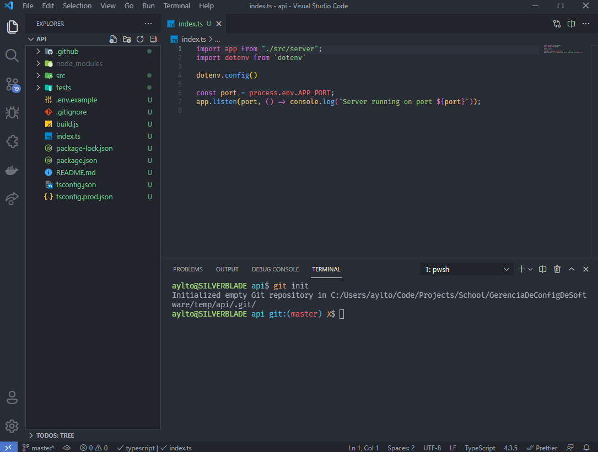
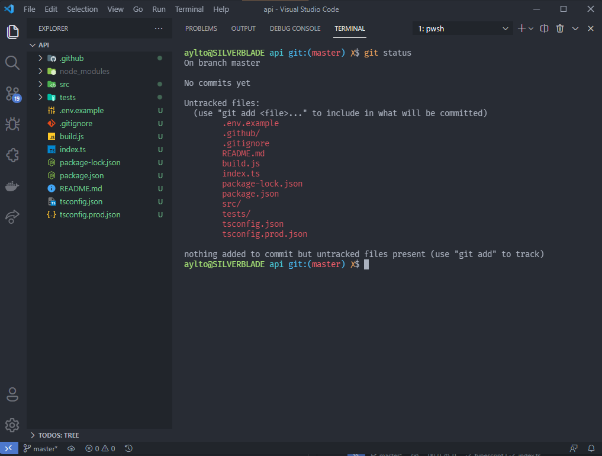
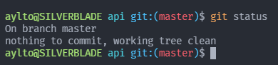
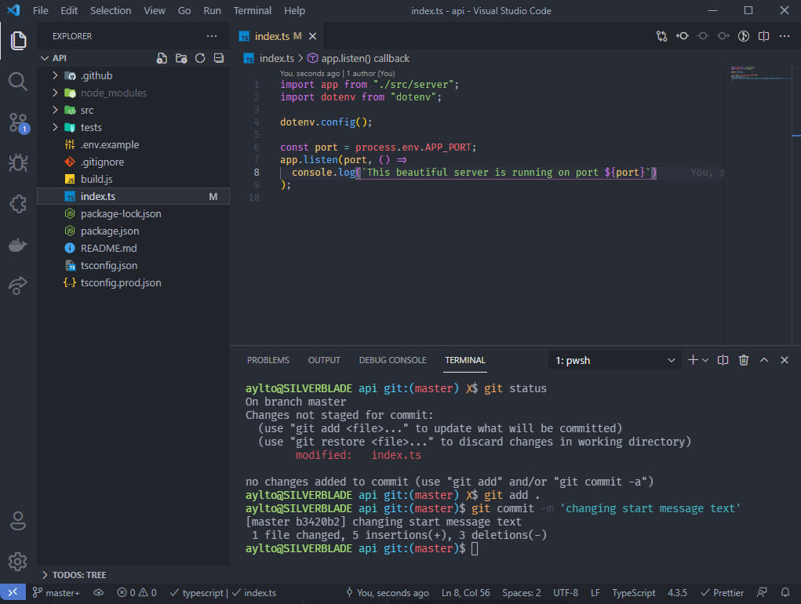
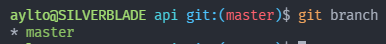
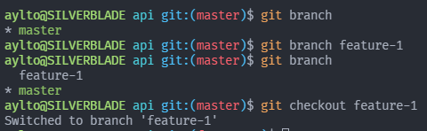
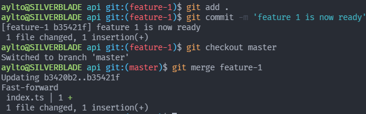

# Aula 2 - Roteiro

O objetivo dessa aula é fazer a introdução ao gerenciamento de versões de uma aplicação utilizando a ferramenta **Git**. Para isso, faremos modificações em nossa **Students API** a fim de criarmos novas versões que podem ser revisadas para que possamos ver um **histórico de modificações** da aplicações. Ao final do roteiro, apresento a atividade proposta para essa aula.

## Gerenciando versões localmente com o Git

O primeiro passo de todos é **inicializar** o **Git** em nossa aplicação. Isso pode ser feito por meio do comando `git init`. Ele gera uma **pasta oculta** `.git`, essa que armazena os dados de versionamento da aplicação. Para executar o comando, basta abrir a pasta do projeto em um **terminal**, abaixo ele foi aberto no **VSCode** e estou usando seu terminal integrado.



Para saber se o comando foi executado corretamente basta ler o _output_ e verificar que ele diz que um novo **repositório git** foi inicializado com sucesso. Além disso podemos usar o comando `git status` para que ele nos mostre o estado dos arquivos atuais em relação à nossa versão base. Abaixo podemos ver que possuímos diversos arquivos com o estado _untracked_. Isso significa que eles ainda não foram adicionados ao sistema de versionamento.



Por conta disso, nosso próximo passo é adicionar esses arquivos ao sistema de versões, além de criar nosso primeiro **commit**, ele que é o representativo de nossa primeira versão.

```bash

  # Para adicionar os arquivos ao versionamento, usamos o comando add seguido do caminho para os arquivo que queremos
  # adicionar. Geralmente utilizamos o ponto, esse que significa todos arquivos nessa pasta.
  git add .

  # Após os arquivos terem sido adicionados, precisamos gerar um commit com as alterações mais recentes.
  # Para isso usamos o comando commit. Uma boa prática é adicionar a flag -m para adicionar uma mensagem ao commit.
  git commit -m 'initial commit'

```

E simples assim, geramos nossa **primeira versão**. Para verificarmos que ela foi criada, podemos rodar o comando `git status` novamente, sendo que ele deverá dizer que não existem modificações feitas.



Pronto, agora temos nossa **primeira versão**, mas como geramos novas versões? Basta fazer novas alterações e executar os comandos `add` e `commit` novamente. Abaixo modifiquei a mensagem mostrada quando a **API** é executada e criei uma nova versão como exemplo.



Com esse pouco conhecimento, poderíamos seguir desenvolvendo nosso app e gerando novas versões até que ele estivesse pronto, porém conforme o sistema cresce, pode ser interessante manter uma versão **estável** ao mesmo tempo que trabalhamos em novas funcionalidades. Para isso, utilizamos de _branches_, essas que permitem que nós criemos uma **réplica da versão atual**, modifique ela e depois junte na versão estável da aplicação, tudo isso enquanto mantemos uma versão funcional em nossa **primeira branch**.

Para ver quais _branches_ existem no projeto, basta executar o comando `git branch`. Ele mostra em verde a _branch_ em que estamos atualmente e as demais em cinza. Por padrão, todo repositório é inicializado com uma branch chamada **master** (Recentemente alguns sistemas estão utilizando o nome **main** como a _branch_ base).



Para criarmos uma nova _branch_, basta executar o comando `git branch` seguido do nome da nova _branch_. Já para irmos até essa _branch_, basta utilizarmos o comando `git checkout` seguido do nome da branch desejada.



Estando em uma nova _branch_ podemos fazer quando modificações e _commits_ quisermos, sendo que podemos voltar à _branch_ principal utilizando o mesmo comando `git checkout` seguido do nome dela, **master**. Supondo que ja tenhamos finalizado essa nova funcionalidade, e que ela esteja pronta para ser colocada junto de nossa **versão estável**, basta utilizarmos irmos para a _branch_ em que queremos jogar nossas mudanças, no caso a **master**, e usarmos o comando `git merge` seguido do nome da _branch_ que contém a nova funcionalidade.



Como podemos ver acima, após finalizada nossa nova feature, eu peguei ela e coloquei em nossa _branch_ principal, sendo que o **git** nos da um relatório mostrando quais arquivos foram modificados e quantas linhas foram adicionadas (simbolizadas pelo mais) por exemplo.

## Atividade Proposta

Para utilizar os conhecimento aprendidos nessa aula, realize mudanças em nossa **Students API** a fim de criar uma nova versão, para isso:

- Inicialize um repositório
- Crie um _commit_ inicial
- Crie uma _branch_ para desenvolver sua nova feature
- Faça as modificações necessárias e crie uma nova versão
- Faça o _merge_ de sua nova feature na branch **master**

Como recomendação, uma feature interessante é uma rota de `update` para os estudantes, na qual ela recebe um `studentId` e o **JSON\*** contendo os atributos a serem modificados no estudante daquele id. Estou disponível para qualquer dúvida que vocês venham a ter.

**JSON:** Javascript Object Notation, ou JSON, é um padrão de **armazenamento** e **transporte** de dados no formato texto utilizado com frequência por **aplicações Web**. Nele são usados pares de **chave/valor** para representar valores reais. Abaixo está um simples exemplo de como representar um **estudante** de nossa **API** seguindo esse padrão:

```JSON
  {
    "id": 1,
    "name": "John Doe",
    "birth": "1999-01-01T00:00:00.000Z",
    "email": "john.doe@email.com",
    "city": "Belo Horizonte",
    "courses": [
      {
        "name": "Calculo 1",
        "teacher": "Teacher 1"
      },
      {
        "name": "Calculo 2",
        "teacher": "Teacher 2"
      },
    ]
  }
```
