# Aula 3 - Roteiro

O objetivo dessa aula é armazenar o código de nossa aplicação em um **repositório remoto**. Para isso, usaremos o **Github**, serviço gratuíto que nos permite criar **repositórios remotos**, aonde conseguimos **armazenar** e **gerenciar** as versões de nossos projetos, assim como gerenciar as **atividades** que devem ser realizadas.

## Gerenciando versões remotamente com o Github

O primeiro passo é criar um conta no **Github**, para isso, basta seguir este [link](https://github.com/signup?ref_cta=Sign+up&ref_loc=header+logged+out&ref_page=%2F&source=header-home) e preencher com seus dados de cadastro.

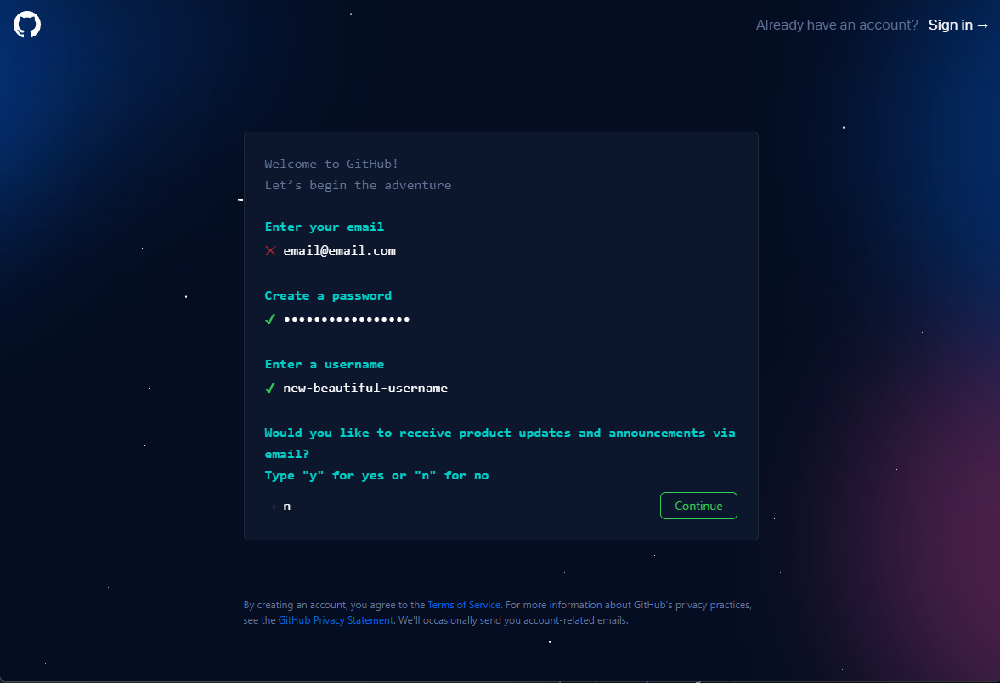

Após criar sua conta, sua página inicial parecerá com a seguinte foto.

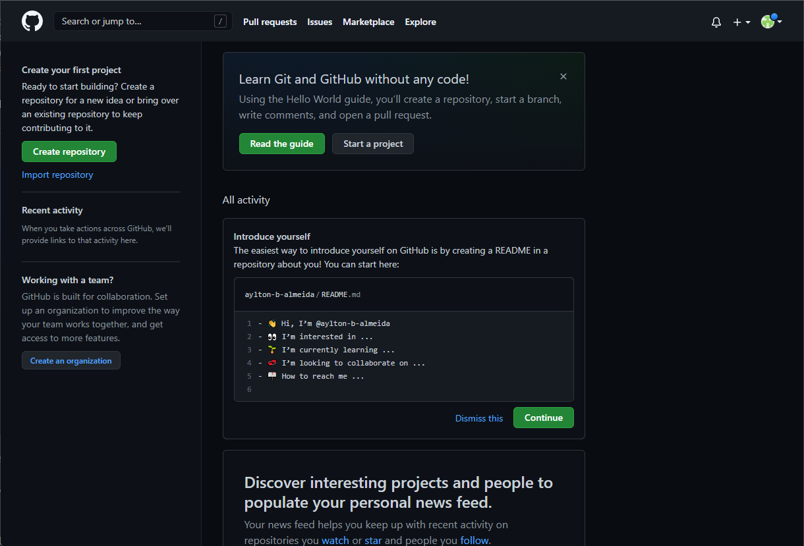

Tendo sua conta criada, agora vamos criar o repositório para armazenar nossa **Students API**, basta seguir os seguintes passos.

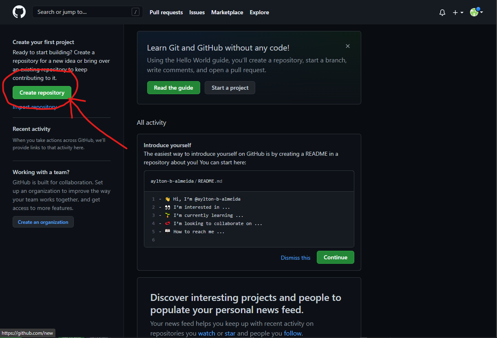
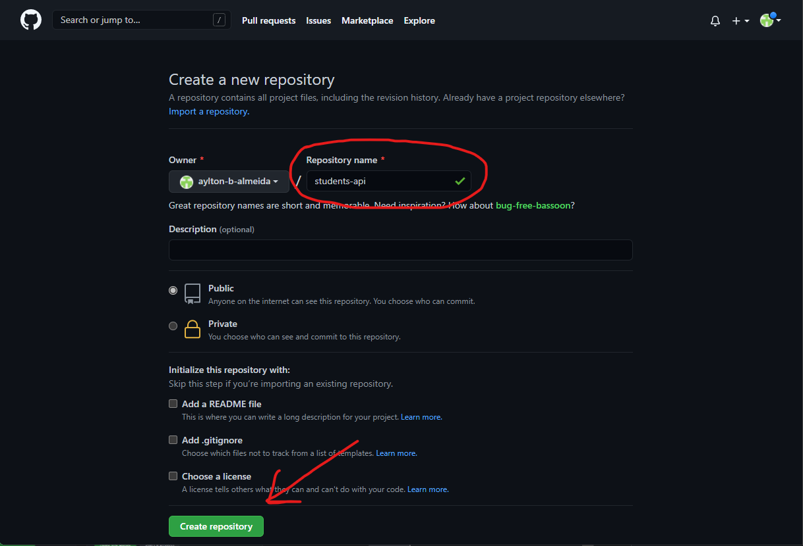

Após criar seu repositório, você será redirecionado para uma página semelhante à da seguinte foto. O mais importante é **copiar o link** circulado, usaremos ele mais tarde para fazer a conexão com nosso repositório local.

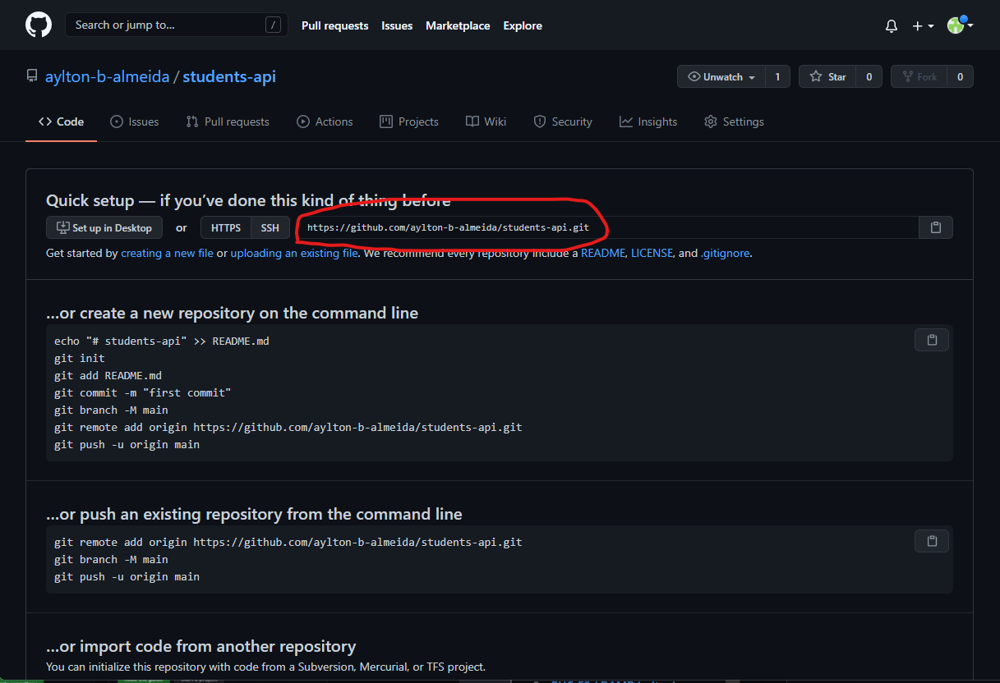

Tendo criado nosso **repositório remoto**, agora precisamos fazer a conexão dele com nosso **repositório local**. Para isso vamos abrir nosso projeto usando o **VSCode** e, em seu **terminal integrado**, siga os seguintes passos.

```bash

  # A conexão com um repositório remoto está sempre associada com o
  # comando remote, dessa forma, usamos o comando remote add junto da
  # url do repositório (Link copiado no passo anterior) para
  # adicionar um novo repositório.
  git remote add origin <URL DO SEU REPOSITÓRIO AQUI>

  # Após informarmos o git que desejamos nos conectar com o repositório
  # remoto por meio dessa url, precisamos conectar nossa branch local
  # com uma branch remota. Para isso usamos o seguinte comando:
  git push -u origin master

```

Para verificarmos que nossa aplicação já está em nosso **repositório remoto** basta voltarmos ao link do repositório no **Github**. Nele conseguimos ver agora que nosso código já está aqui.

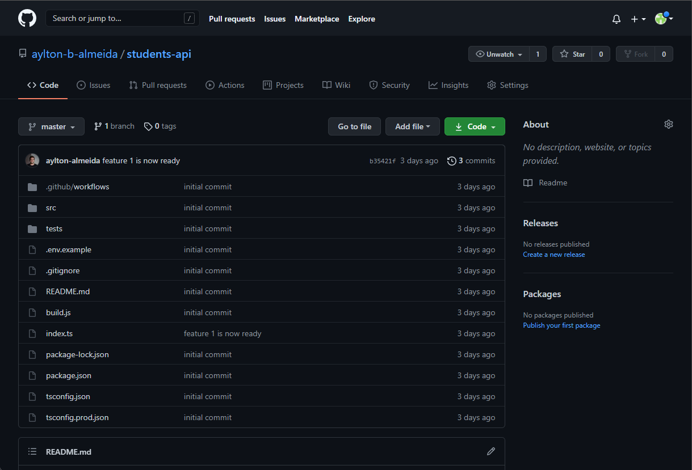

Pronto, nosso repositório já está salvo em segurança remotamente. Porém e caso eu queira baixa-lo em outro computador? Basta usar o comando `git clone` seguido da url do seu repositório no **Github**.

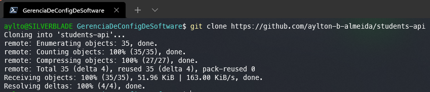

Após finalizado, o comando deveria gerar uma pasta com o mesmo nome do repositório contendo todo seu conteúdo. Agora que nosso código já está salvo, queremos fazer alterações nele e salva-las novamente no **Github**. Para isso, faça alguma alteração em nosso código e crie um novo **commit**. Após ter uma nova versão, basta usar o comando `git push` para enviar essas modificações ao **repositório remoto**.

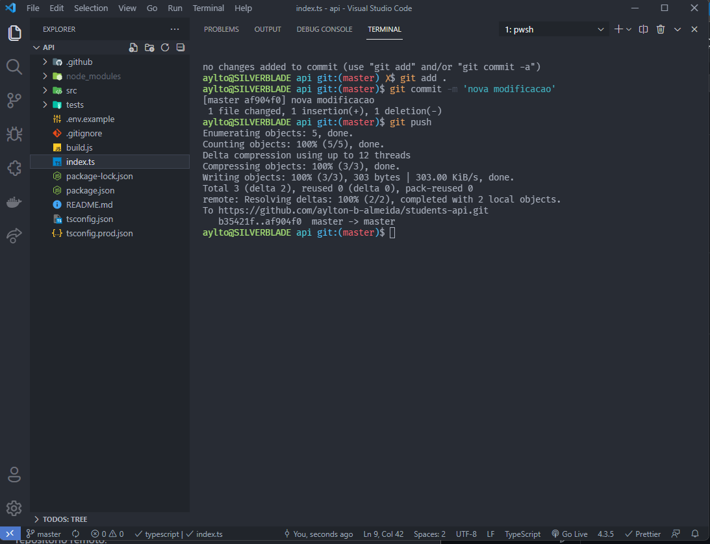

Por fim, para baixarmos uma modificação feita por outra pessoa ou em outro computador, basta utilizarmos o comando `git pull`. Para isso, volte ao seu repositório no **Github** e modifique algum arquivo usando seu editor e criando um novo **commit**. Depois use o comando `git pull` para trazer essa modificação para seu computador.

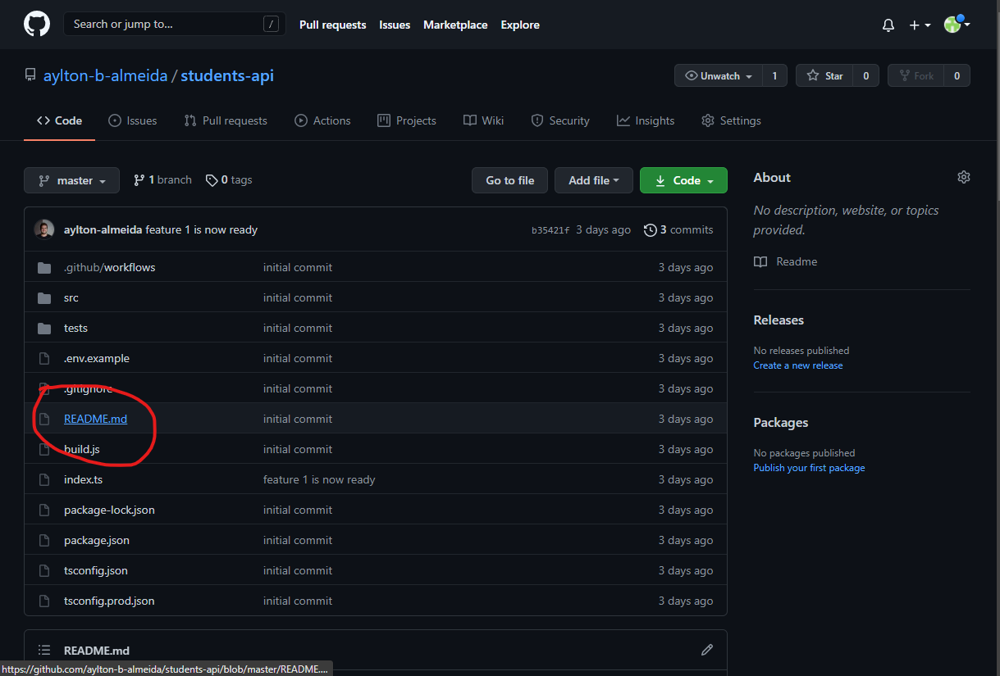
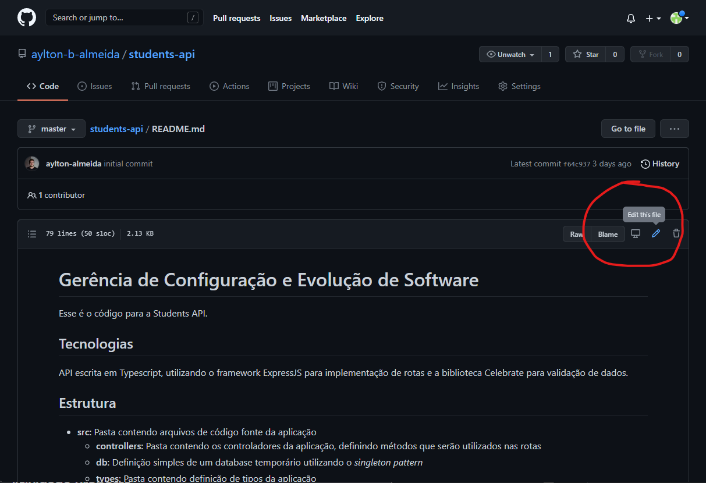
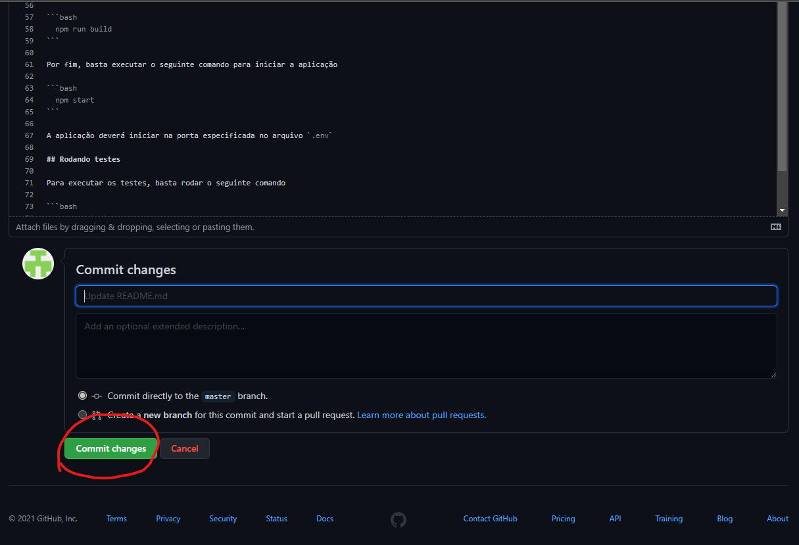
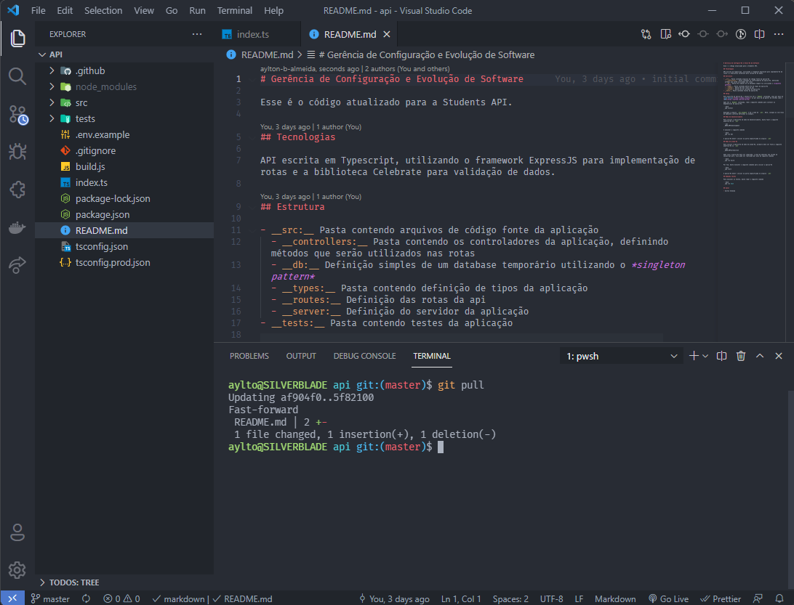

## Atividade Proposta

Para utilizar os conhecimento aprendidos nessa aula, crie um repositório no **Github** e envie sua api local para ele. Tendo salvo ela remotamente, faça uma nova feature e utilize os comandos `git` aprendidos para enviar suas mudanças ao repositório remoto.

Como recomendação, uma nova feature interessante é uma rota de `delete` para os estudantes, na qual ela recebe um `studentId` e caso ele exista, deleta aquele estudante. Estou disponível para qualquer dúvida que vocês venham a ter.
