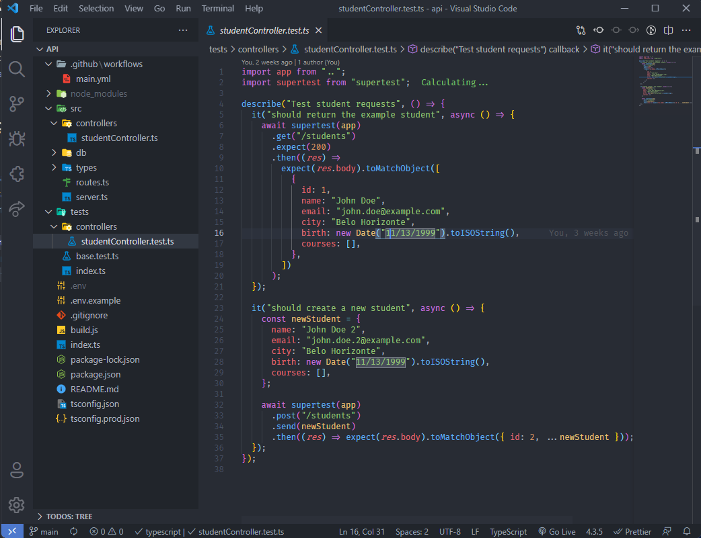
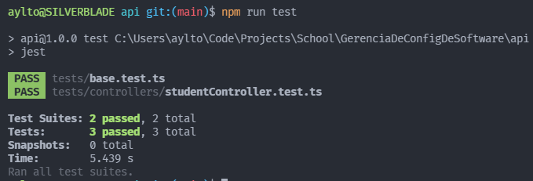
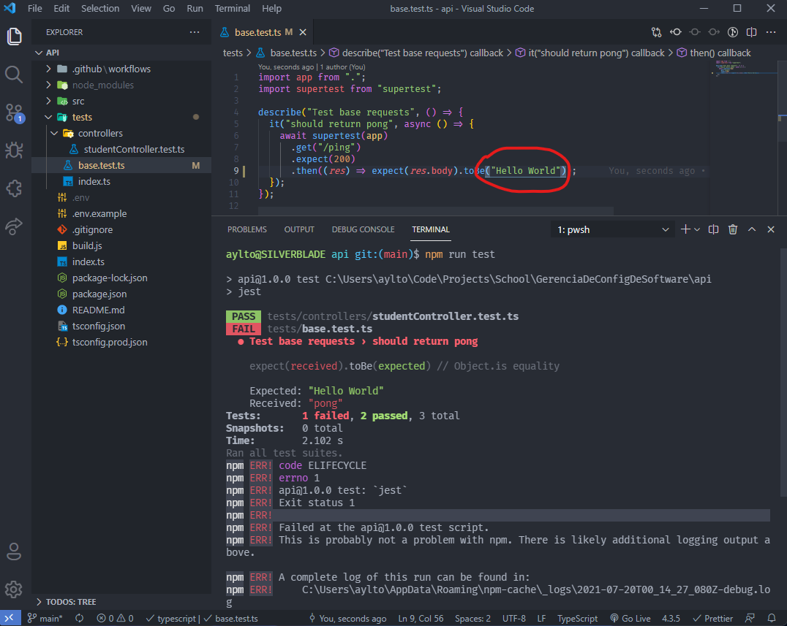
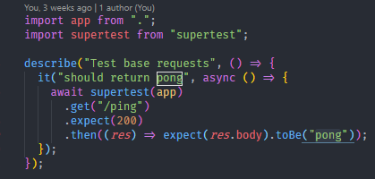
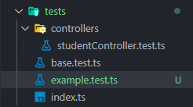
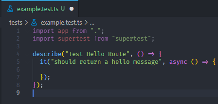
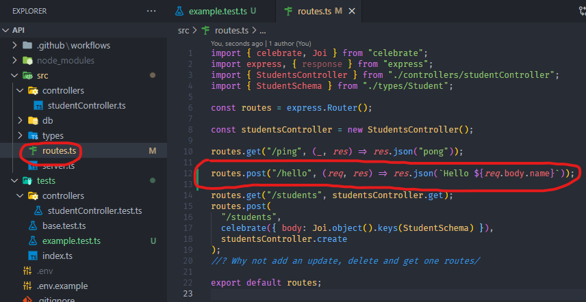
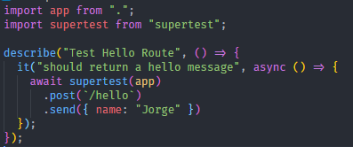
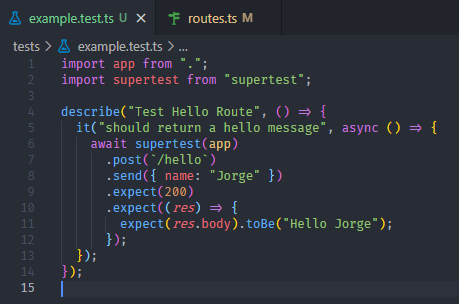
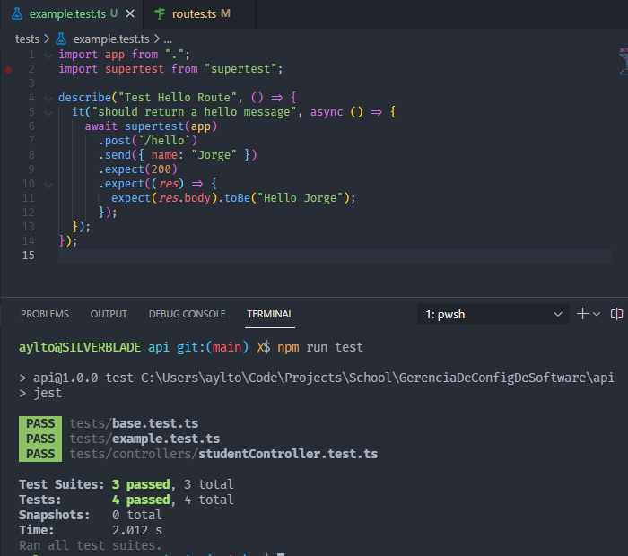

# Aula 4 - Roteiro

Para essa aula mostraremos como **implementar** e **executar** **testes unitários**. Para isso, usaremos as bibliotecas **Jest** para executar os testes e **supertest** para construi-los.

Vídeo de apoio para aula:

- [Testes](https://youtu.be/8BlMSxiYid0)

## Executando e interpretando os resultados

Inicialmente vamos aprender como executar testes em nossa aplicação. Para definir um arquivo de teste basta adicionar a extensão `.test` no arquivo, temos um exemplo dentro de `tests/controllers` com o arquivo `studentController.test.ts`. Esse arquivo tem como objetivo testar o arquivo `studentController.ts`, localizado dentro de `src/controllers`.

Em nosso projeto, executamos os testes por meio do comando `npm run test`. Abaixo podemos ver como é um _output_ positivo.

Na imagem é possível ver que 2 _Suites_ (ou arquivos) foram executados, esses que continham 3 testes. Todos os testes passaram como podemos ver por meio da palavra **pass** ao lado do nome de cada arquivo. Porém o que acontece caso um teste falhe? Vamos alterar o arquivo `base.test.ts` da seguinte forma e rodar nossos testes.

Esse teste esperava ver que a rota `/ping` retornasse uma mensagem `pong`, porém ao mudarmos a resposta esperada, o teste passou a falhar. Como podemos ver, a ferramenta não só mostra que **1 teste falhou**, como também que **2 passaram** do total de **3 testes**. Ela também mostra em qual _assertion_ ele encontrou o erro, ou seja, qual parte do teste não deu certo.

## Implementando os testes

Sabendo ler os resultados, vamos agora ver como fazemos um teste. Para isso estudaremos o teste da rota `/ping`. Ela é uma rota bem simples, simplesmente retorna a palavra `pong`. Vamos então, para o arquivo `tests/base.test.ts`.

Nele, importamos nosso **app flask** assim como a biblioteca **supertest**. Nosso objetivo é usa-la a fim de testar a rota `/ping`. Para isso usamos a função `describe()` para definir um bloco de testes e a função `it()` para definir o caso de teste. Por estarmos testando uma requisição **REST**, a função de teste deve ser assíncrona, recebendo a **keyword** `async`. Dessa mesma forma, ao chamarmos a função do **supertest** colocamos antes a palavra `await`, de forma que o teste só se da por terminado quando ela tiver acabado de fato. Após chamarmos o método `supertest` passando nosso **app** como parâmetro, precisamos chamar o método **REST** da rota a ser testada, sendo no caso o método **GEt**, recebendo uma `string` contendo a rota de fato. Em seguida usamos uma função de _assertion_, a `expect`, que como esperado, espera que o resultado recebido seja semelhante ao parâmetro passado. No caso, ela espera que o resultado da requisição seja **200**, código **HTTP** para OK. Por fim recebemos a resposta da requisição e utilizamos novamente o `expect`, dessa vez para ver se o `body` contém a mensagem esperada `pong`.

Para entendermos melhor o que foi explicado vamos fazer um exemplo básico. Vamos criar um novo arquivo para testes chamado `example.test.ts`

Nele vamos descrever nosso primeiro bloco de testes para uma nova função na rota `/hello`, que deveria nos retornar uma saudação.

Após termos preparado nossa estrutura base vamos definir nossa rota dentro do arquivo `src/routes.ts`. Nela, recebemos um nome e retornamos uma saudação com o nome enviado, por exemplo, se enviarmos Jorge, receberemos `Hello Jorge`.

Para termos certeza que ela funciona, basta finalizarmos seu teste. Para isso, vamos utilizar o **supertest** para fazer uma requisição **POST**, com um nome no **body**.

Tudo certo, porém nosso teste não está de fato verificando nada. Para resolver isso vamos usar o que aprendemos e verificar se ele retorna um código **200**, assim como uma saudação com o nome enviado.

Por fim, basta executarmos o test como o comando `npm run test` e verificar que tudo está certo.

## Atividade Proposta

Para utilizar os conhecimento aprendidos nessa aula, você deveria criar testes para as funções implementadas em nossas ultimas duas aulas. Para isso, basta usar as bibliotecas **jest** e **supertest** já instaladas e escrever testes para pelo menos **duas rotas** desenvolvidas.

Utilize os testes já implementados para as rotas de **GET** e **POST** da **Students API** de exemplo para seus testes.
