# Aula 5 - Roteiro

Nesta aula mostrarei como construir um _pipeline_ usando o **Github Actions** com o objetivo de automatizar o processo de _build_ e _teste_ de um projeto, assim como o _deploy_ dele. Essa pratica também é conhecida como _CI_ (Continuous Integration) e _CD_ (Continuous Delivery).

## Preparando uma pipeline simples

Para criar uma pipeline pelo **Github Actions** basta criarmos as pastas `.github/workflows` no diretório de nosso repositório e dentro dela criarmos um arquivo dentro `main.yml` (`yml` ou `yaml` é um formato de estruturação de dados moderno, leia mais sobre [aqui](https://pt.wikipedia.org/wiki/YAML)).

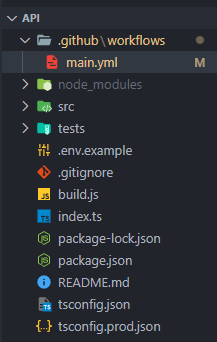

Tendo criado nosso arquivo, precisamos agora escrever dentro dele o que nossa _pipeline_ deverá fazer. Para o propósito dessa aula, queremos **instalar os pacotes** necessários para nossa aplicação, fazer o _build_ do app e executar os **testes unitários**. Futuramente também iremos criar um _deploy_ para o servidor.

Para começar, vamos ver alguns comandos básicos do **Github Actions**, lembrando que a documentação completa pode ser encontrada [aqui](https://docs.github.com/en/actions).

```yaml
# O atributo name define o nome de nossa pipeline, para que possamos localizá-la no gitHub.
name: Students API Pipeline

# O atributo on define quando um pipeline deverá ser executado. Nessa caso precisamos que ele seja
# executado quando um novo push for feito ao repositório na branch main
on:
  push:
    branch: main

# O atributo jobs define os jobs que serão executados.
jobs:
  # Inicialmente vamos declarar um job com o nome hello, que fará um simples 'hello world'
  hello:
    # O atributo runs-on define em qual ambiente o job será executado. Nesse caso usaremos um ambiente Ubuntu
    runs-on: ubuntu-latest

    # O atributo steps define os passos que serão executados durante o job.
    steps:
      # Nesse caso, teremos somente um step chamado 'Say Hello' que simplesmente imprimirá o texto 'Hello World'
      - name: Say Hello
        run: echo "Hello World"
```

Insira o código acima dentro de `main.yml`, crie um novo **commit** e envie para o **Github** por meio de um **push**.

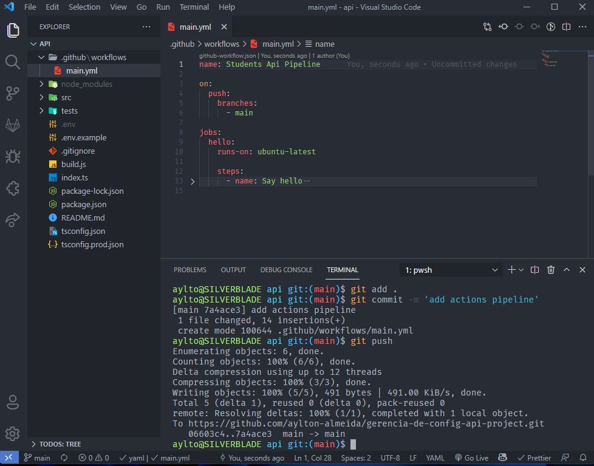

Se formos até o **Github**, entrarmos em nosso repositório e acessarmos a seção **actions** veremos que a pipeline foi executada com sucesso.

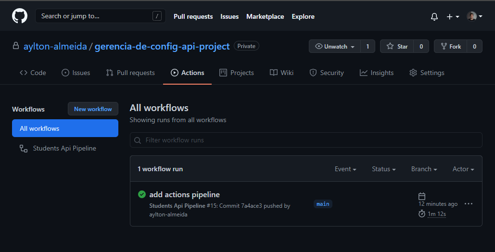

Se selecionarmos a _pipeline_ e escolhermos o _job hello_, podemo ver os _steps_ executados no job. No caso toda **pipeline** no **Github Actions** possui dois _steps_ padrão: o **Set up job** e **Complete Job**, que preparam o ambiente para execução de nossa _pipeline_. No nosso caso, também é possível ver o _step_ _Say Hello_, que simplesmente imprime o texto 'Hello World', como instruímos ele a fazer.

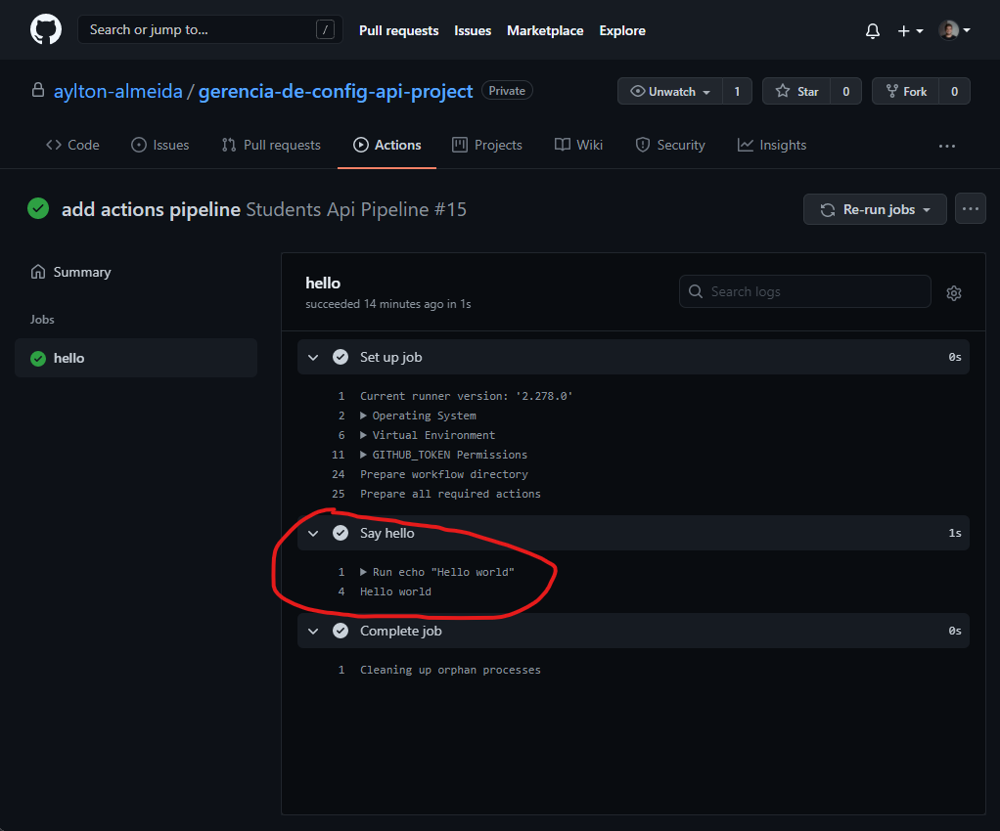

Agora que sabemos o básico do **Github Actions** vamos explorar um outro recurso muito importante. Esse recuso são as **actions**, que são repositórios públicos que definem ações usadas com frequência dentro de _pipelines_. Um exemplo muito usado é a [**checkout**](https://github.com/actions/checkout) que nos permite fazer o **checkout** em nosso repositório durante a _pipeline_, de forma a usarmos seus arquivos durante ela.
Um exemplo simples é usa-la para entrar no repositório e listar todos diretórios e arquivos. Vamos modificar nosso `main.yml` para fazer isso:

```yaml
name: Students API Pipeline

on:
  push:
    branch: main

jobs:
  hello:
    runs-on: ubuntu-latest

    steps:
      - name: Say Hello
        run: echo "Hello World"

  # Vamos adicionar um novo job chamado listing, que lista tudo que tem dentro do repositório
  listing:
    runs-on: ubuntu-latest

    steps:
      - name: Checkout repo
        # Quando usamos uma action usamos o atributo uses ao invés de run
        uses: actions/checkout@v2
      - name: List all files
        run: ls
```

Vamos fazer um novo commit e verificar o resultado.

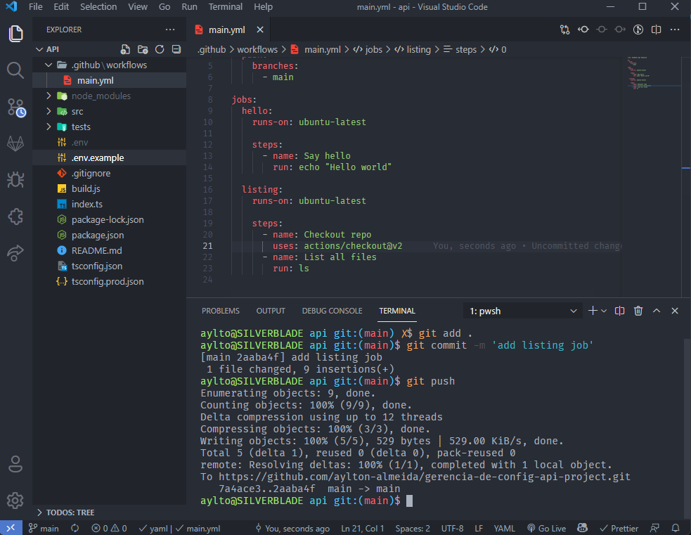

Quando chegamos no painel da _pipeline_ executada, podemos ver que existem dois _jobs_: **hello** e **listing**.

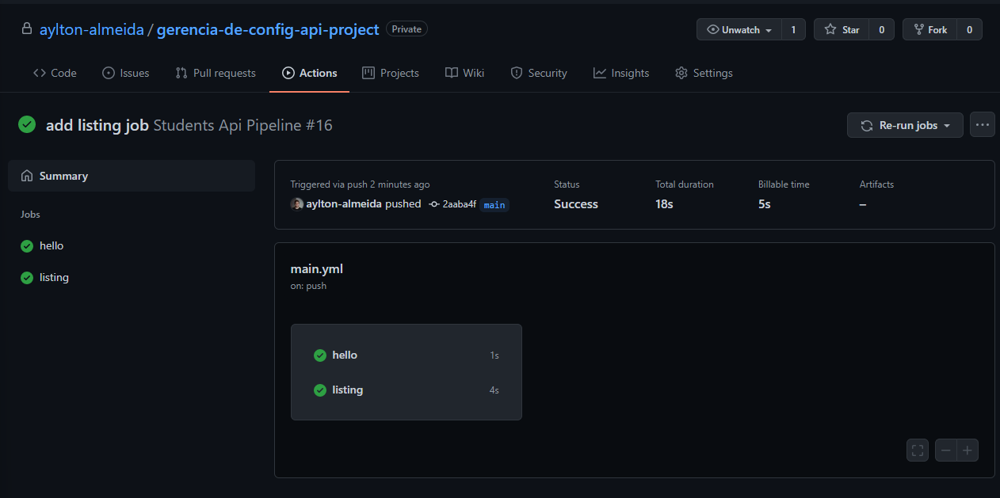

Quando abrimos os detalhes do _job listing_ podemos ver que a _action_ **checkout** cria dois _steps_ extras: _Checkout repo_ e _Post checkout_. Porém também foi criado nosso _step_ **List all files**, se olharmos ele veremos que ele nos mostra uma lista com todos os arquivos e diretórios do repositório.

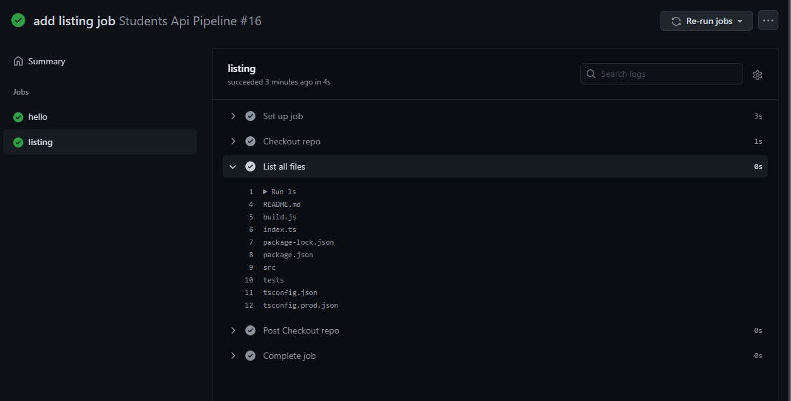

Por ultimo, precisamos ver como configurar nossos _pipeline_ para que ele use variáveis de ambientes como as duas presentes no `.env` de nossa **API**. Para adicionar variáveis de ambiente ao nosso projeto, vamos alterar nosso _job_ "Say Hello" de forma que ele diga o nome escrito em uma variável `NAME`.

```yaml
jobs:
  hello:
    runs-on: ubuntu-latest

    steps:
      - name: Say Hello
        # Declarar variáveis é tão simples quanto declarar um atributo env e chamar os valores armazenados nos secrets do repositório
        env:
          NAME: ${{secrets.NAME}}
        run: echo "Hello $NAME"
```

Para armazenar a variável em nosso repositório, precisamos ir em _settings > secrets_ e adicionar uma nova variável.

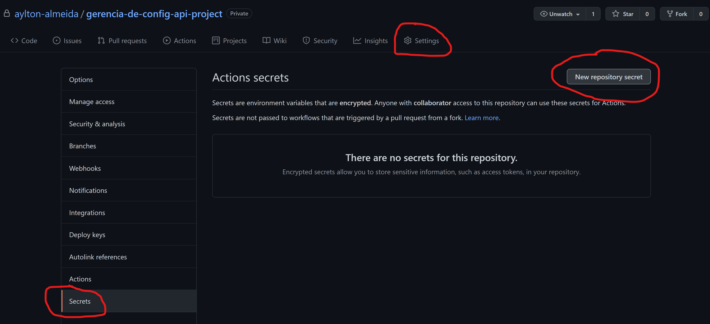
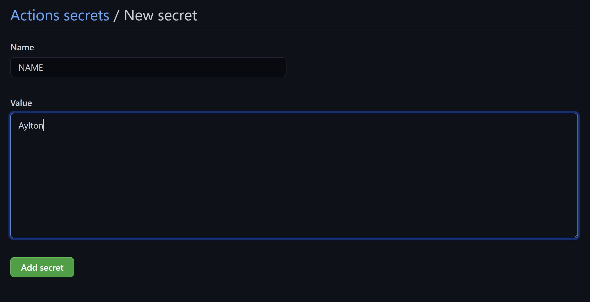

Por fim, vamos criar um novo **commit** com essa modificação em nosso _job_ e verificar que ele é executado corretamente.

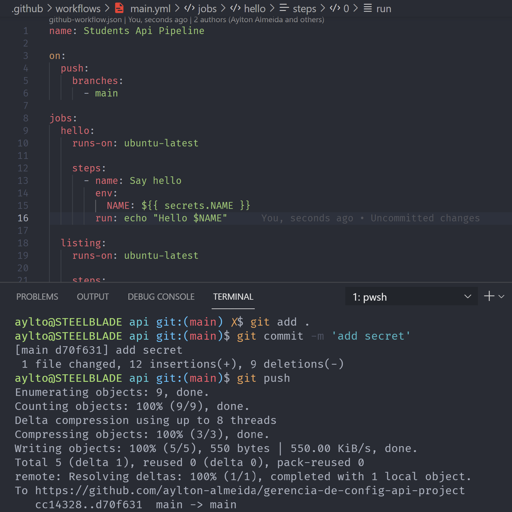
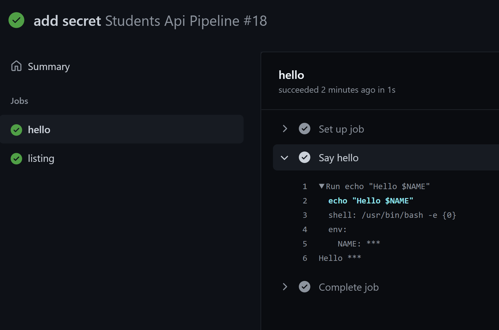

Como podemos ver, foi escrito 'Hello \*\*\*', isso ocorre pois o próprio **Github** censura as variáveis durante as _pipelines_ por questões de segurança.

## Atividade Proposta

Para colocarmos em prática o que vimos hoje, vamos criar uma pipeline simples para o nosso projeto. Nela devemos fazer o **checkout** dentro dele, rodar todos os testes e executar um _build_, listando ao fim o conteúdo da pasta `dist` com os arquivos prontos para implantação do app. Para isso precisamos fazer os seguintes passos:

- Use o comando `npm install` para instalar as dependências do projeto.
- Use o comando `npm run test` para rodar os testes.
- Use o comando `npm run build` para fazer o _build_ do projeto.
- Use o comando `ls dist` para listar o conteúdo da pasta `dist`.

Lembre-se que em uma _pipeline_ segura, caso os testes falhem o _build_ não será executado. Também é interessante declarar nossas variáveis de ambiente (`$NODE_ENV` e `$PORT`) durante as etapas de _test_ e _build_.
