# Aula 6 - Roteiro

O objetivo desta aula é mostrar como conectar nossa **Students API** à um banco de dados remoto. Para isso usaremos um banco **PostgreSQL**, hospedado no serviço **Heroku**, e a biblioteca **TypeORM**, responsável por fazer a conexão entre nossa API e nosso BD.

Um ORM, ou _Object Relational Mapper_, é uma biblioteca que nos permite trabalhar com objetos e relacionamentos entre diferentes bancos de dados. Para isso, ele abstrai a lógica da linguagem do banco, como o **SQL** no caso, para uma linguagem comum à API, no caso **Typescript**.

Abaixo está disponível um video mostrando como configurar um banco de dados no Heroku:

[Configurando um projeto e banco de dados no Heroku](https://www.youtube.com/watch?v=8ceTDyHYW5E)

## Usando TypeORM para conectar oa nosso banco de dados

Para começar, vamos fazer a instalação do TypeORM e suas dependências com o comando `npm install`.

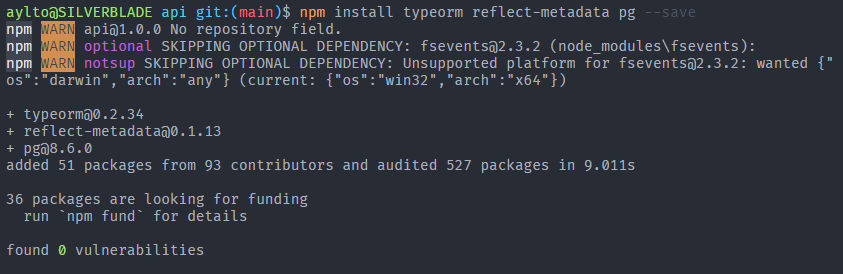

No comando acima estamos instalando o **TypeORM** e duas dependências, **pg** e **reflect-metadata**. A mais relevante é a primeira, que é um _driver_ necessário para conexão à um banco de dados postgres enquanto.

Tendo instalado nossas dependências iniciais, vamos agora modificar nossas variáveis de ambiente, inserindo nossa url de conexão ao bando de dados obtida do Heroku. Para isso, vamos modificar nosso `.env.example` e nosso `.env`, adicionando a variável `DATABASE_URL` e colocando o valor da url do banco de dados obtida do Heroku.

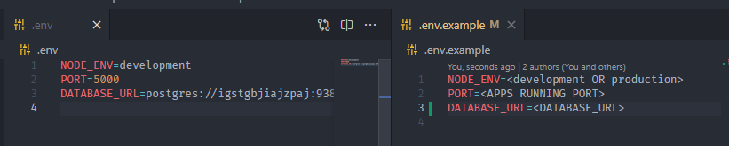

Para que o **TypeORM** funcione corretamente, precisamos importar a biblioteca **reflect-metadata** no nosso arquivo `index.ts` da seguinte forma.

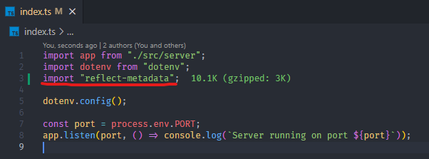

Tendo feito nossa configuração inicial, vamos agora transformar nossa classe `Student` em uma `entity`. `Entities` no **TypeORM** são representações de tabelas no banco de dados. Dessa forma comunicamos à biblioteca que queremos criar uma table `Students` com os atributos especificados na classe. Para isso vamos renomear nossa pasta `types` uma `entities` e modificar o arquivo `Student.ts` da seguinte forma.

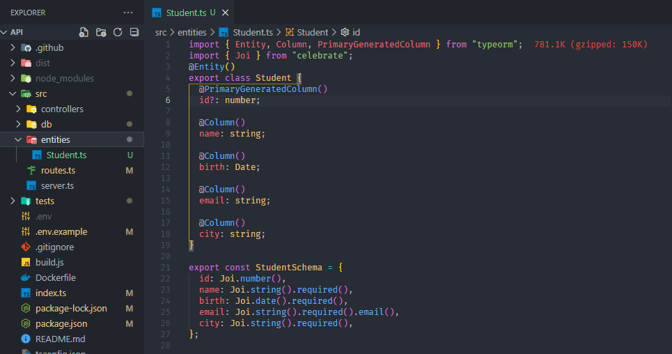

Na imagem acima é possível ver que agora nossa classe `Student` é uma `entity`. Isso é possível graças ao _decorator_ `@Entity()`. Da mesma forma, usamos os _decorators_ `@Column()` para criar colunas e o atributo `@PrimaryGeneratedColumn()` para criar colunas primárias com auto-incremento.

Agora, precisamos mostrar ao **TypeORM** como fazer criar uma nova conexão ao nosso banco de dados. Para isso, crie um arquivo `config.ts` na pasta `db` com o seguinte conteúdo:

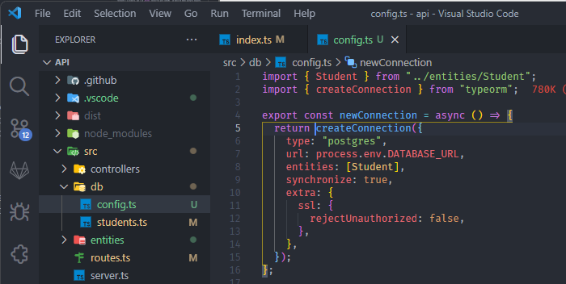

No arquivo `config.ts` usamos a função `createConnection` do **TypeORM** para declarar uma nova conexão ao banco de dados com a url armazenada na variável `DATABASE_URL`. Também declaramos uma lista com nossas entidades, atualmente contendo somente a `Student`. Para criarmos de fato essa conexão, basta importarmos essa função no nosso arquivo `index.ts` e chamar ela.

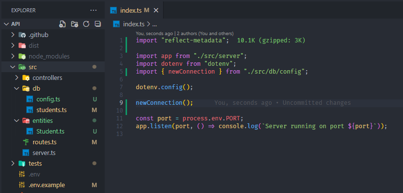

Se executarmos nossa aplicação agora e olharmos nosso banco de dados por meio do **PGAdmin** (Explicação de como instalar e usar o **PGAdmin** no vídeo da introdução) vamos ver que temos uma tabela `students` com os atributos especificados na classe `Student`.

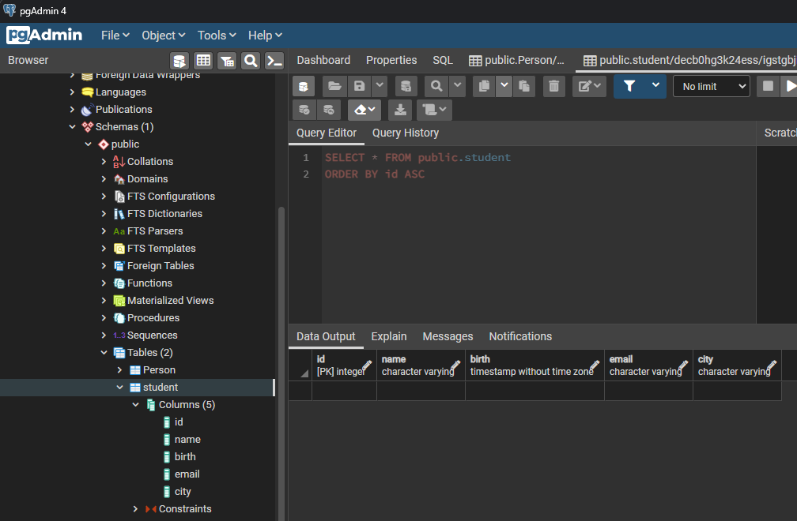

## Consultando e Escrevendo dados no banco de dados

Agora que conseguimos conectar em nosso banco de dados, vamos ver como fazer uma consulta simples, equivalente à um `SELECT * FROM student`. Para isso, crie um estudante no banco de dados usando o **PGAdmin**.

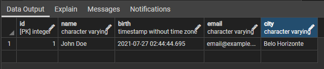

Agora vamos editar o arquivo `students.ts`, localizado dentro de `src/db/` a fim de usarmos o bando de dados **Postgres** ao invés do objeto local. Vamos atualizar a função `getStudents` da seguinte forma:

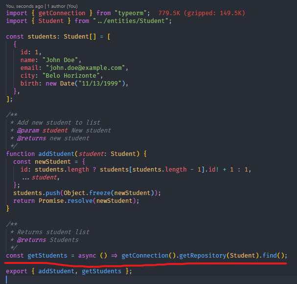

Como podemos ver na imagem acima, usamos a função `getConnection()` para pegar a conexão inicializada no `index.ts`. Após recuperada, usamos a função `getRepository()` passando a entidade `Student` como parâmetro para identificarmos com qual entidade estamos trabalhando. Por fim usando a função `find()` para fazer uma consulta simples.

Agora vamos fazer alterações na função `addStudent()` a fim de inserir um novo estudante no banco de dados.

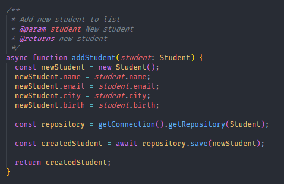

Agora, se fizermos uma nova requisição **POST** passando um estudante novo, veremos que ele está sendo criado em nosso banco de dados. Para termos certeza disso, basta olharmos no **PGAdmin**.

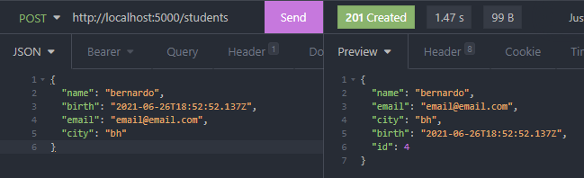
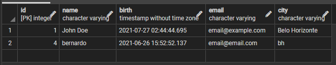

## Atividade Proposta

Para colocarmos em prática o que vimos hoje, vamos atualizar nossa **Students API** para usar sempre dados armazenados em nosso banco de dados **Postgres** no **Heroku**. Para isso atualize as rotas já criadas nas aulas anteriores, de forma que quando você executa-las, o resultado deverá ser consultado e/ou armazenado em nosso banco de dados. Além disso, atualize nossos testes para que eles funcionem junto com nosso banco de dados. Para isso, você pode usar de mocks para evitar que os testes possam rodar localmente mesmo quando não conectados à um banco de dados.

**Test Mock:** Tendo em vista que a finalidade de testes unitários é testar apenas uma função ou método, pode ser interessante criar um mock das funções que fazem chamadas ao banco de dados. Para isso, utilize `jest.mock` para modificar os valores de retorno que determinadas funções possuem em seu código. Abaixo está um exemplo do mock da função `addStudent`, localizada no caminho `'../../src/db/students'` em relação ao arquivo de teste. Nela, é pressuposto que ao chamar a função, ela retorna uma `Promise` com o valor de um estudante com id 2.

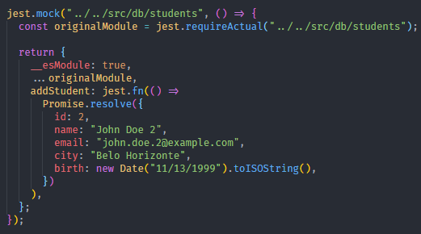
