# Aula 7 - Roteiro

Nesta aula iremos aprender a declarar _containers_ usando arquivos `Dockerfile`. Também aprenderemos como fazer a _build_ deles e executa-los, a fim de permitir uma distribuição mais fácil e maior escalabilidade para nossa aplicação.

Para instalação do **Docker**, basta baixar o instalador adequado ao seu sistema operacional neste [link](https://www.docker.com/products/docker-desktop).

## Criando um container Docker

O primeiro passo para criação de um _container_ está na criação de um arquivo `Dockerfile`. Nesse arquivo precisaremos declarar os comandos necessários para configuração e execução de nosso container. Para este roteiro, vamos criar um novo projeto em **NodeJS** que nos diga uma saudação com base em um nome armazenado em uma variável de ambiente. Para isso, basta criarmos uma nova pasta e executarmos o comando `npm init -y` e abrir o projeto no **VSCode**.


No **VSCode**, vamos criar um arquivo `index.js`, que nada mais faz do que ler uma variável de ambiente `NAME` e diz 'hello' para ela (Em **Javascript** a leitura de variáveis de ambiente é feita por meio do objeto `process.env`). Para testar nosso app, vamos adicionar um comando `start` ao `package.json` que executa nosso arquivo `index.js` e testar nosso app.


Por enquanto iremos ver apenas um 'Hello undefined', já que não declaramos nenhuma variável de ambiente. Porém iremos resolver isso na declaração de nosso container. Comece criando um arquivo `Dockerfile` e siga os passos abaixo para aprender os comandos básicos.

```Dockerfile

# O comando FROM diz ao container qual imagem base usar, nesse
# caso usaremos a imagem do NodeJS versão estável (LTS)
FROM node:lts

# O comando WORKDIR declara em qual pasta estaremos trabalho no
# container. Aqui estamos trabalhando dentro de uma pasta
# chamada app
WORKDIR /app

# O comando copy faz exatamente o que ele sugere, copia os
# arquivos da máquina local para o container, aqui estamos
# copiando ambos index.js e package.json para a pasta atual
# dentro do container.
COPY index.js package.json ./

# O comando ENV é usado para declarar variáveis de ambiente
# Aqui estamos declarando uma variável NAME com valor 'John'
ENV NAME 'John'

# O comando CMD é usado para declarar o que o container fará
# quando for executado. Nele separamos cada parte do comando
# em um item de um array. Em nosso caso ele executará o
# comando npm run start
CMD ["npm", "run", "start"]

```

Antes de executarmos nosso _container_ vamos entender qual é o processo para isso. Inicialmente todo container precisa de uma imagem, essa que determina todos os recursos que o container pode utilizar. Além disso, ela contém qual comando deve ser executado quando ele for iniciado, no nosso caso `npm run start`. Tendo isso em mente primeiro vamos criar nossa imagem com o comando `docker build` seguido da _flag_ `-t`, que nos permite nomear nossa imagem e do caminho para o arquivo `Dockerfile`. Esse comando pode demorar um pouco para ser executado.

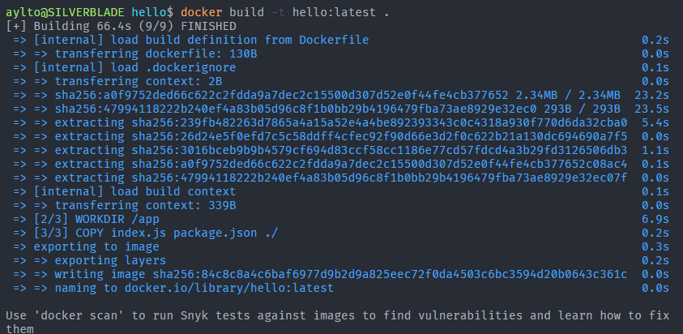

Para conferirmos que nossa nova imagem foi criada, basta executar o comando `docker images hello` e verificar se a imagem `hello:latest` aparece.

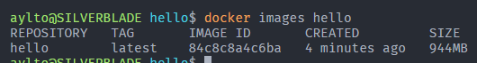

Tendo criado nossa imagem, vamos agora executá-la com o comando `docker run` seguido de seu nome.

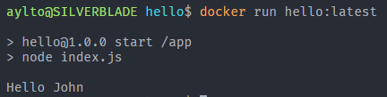

Podemos ver que ele executa nosso app normalmente, usando a variável de ambiente `NAME` que declaramos no `Dockerfile` e mostrando 'Hello John'. Porém e caso tenhamos alguma biblioteca no `package.json` que não esteja instalada, o _container_ não irá funcionar. Para resolver isso, vamos instalar as bibliotecas necessárias. Como exemplo vamos usar a biblioteca `random-name` para dar nomes aleatórios. Instala-la é bem simples, basta executar `npm install random-name --save`. E para usá-la basta importar a biblioteca e chamar o método `random`.

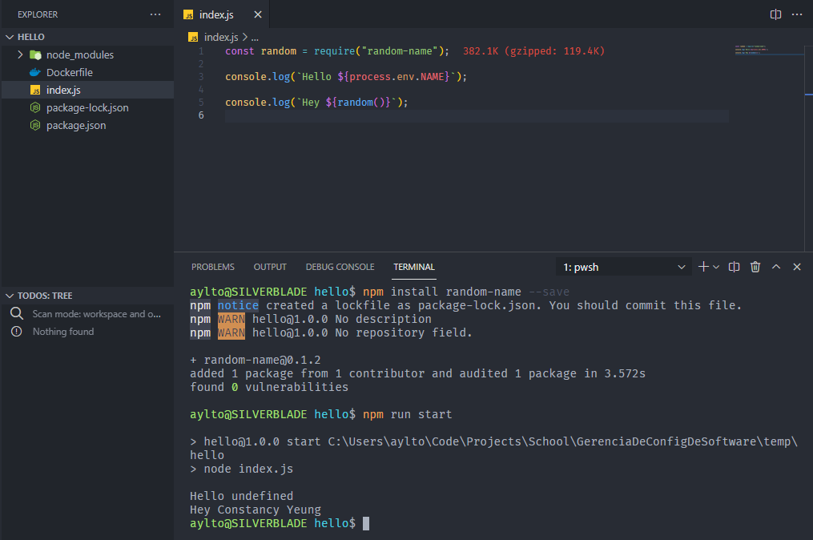

Podemos ver que ele gera um novo nome toda vez que rodamos nossa aplicação. Porém se criarmos uma nova imagem **docker** e executarmos ela, receberemos um erro. Isso porque nossa imagem não possui o módulo `random-name` instalado. Para resolver isso, vamos instalar as dependências de nosso projeto listadas no `package.json` antes de finalizar a criação do container.

```Dockerfile

FROM node:lts

WORKDIR /app

# ë uma boa prática copiar somente o que é necessário
# para executar cada etapa por vez.
COPY package.json .

# O comando run executa um comando dado. Neste caso
# estamos executando o comando npm install para
# instalar as dependências do projeto.
RUN npm install

COPY index.js ./

ENV NAME 'John'

CMD ["npm", "run", "start"]

```

Faça as alterações necessárias no `Dockerfile` e crie uma nova imagem com o comando `docker build`. Quando você executá-la verá que não teremos nenhum erro e que ele dirá dois Hellos, um para John e outro para um nome aleatório.

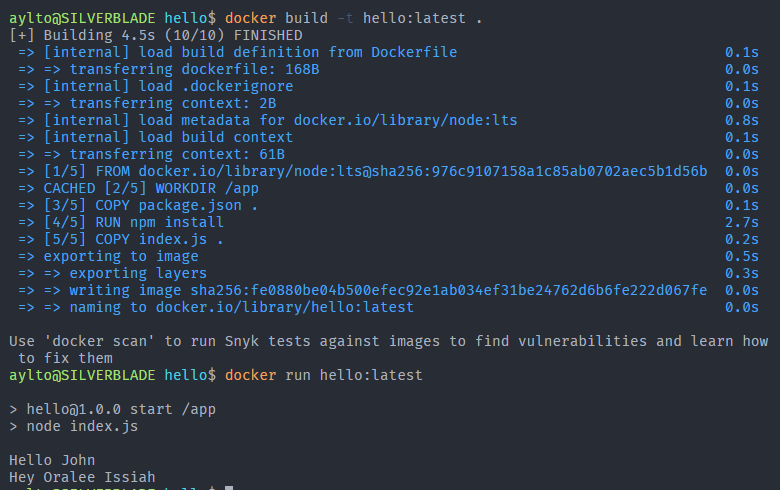

## Atividade Proposta 1

Para colocarmos em prática o que vimos hoje, vamos criar um container para nossa **Students API**. Para isso precisaremos seguir passos semelhantes aos vistos durante esse roteiro. Alguns lembretes:

- Lembre-se que em nossa API, precisamos de muito mais do que somente o arquivo `index.js`, para isso use o `.`, que indica tudo do diretório.
- Alem disso, precisaremos de nossas 3 variáveis de ambiente, `PORT`, `NODE_ENV` e `DATABASE_URL` ao invés de usarmos somente a `NAME`.
- Lembre-se que para executarmos o comando `npm run start` precisamos instalar nossas dependências (`npm install`) e fazer um novo _build_ de nossa api (`npm run build`).
- Por ultimo, para expormos uma porta do container para conexões externas, basta usar a _flag_ `-p` para nosso comando `docker run` (ex: `docker run -p 5000:5000 students:latest`).

## Fazendo deploy de uma imagem docker para o Heroku

Agora que temos nossa **Students API** dentro de um container podemos fazer o _deploy_ dela para um servidor. Para esse roteiro vamos usar o **heroku**. O primeiro passo é visitar nosso projeto no heroku criado na ultima aula e alterar as variáveis de ambiente de forma a colocar as necessárias para execução de nosso app. Para isso abra seu projeto e siga à página _settings_ e selecione a opção _reveal config vars_.

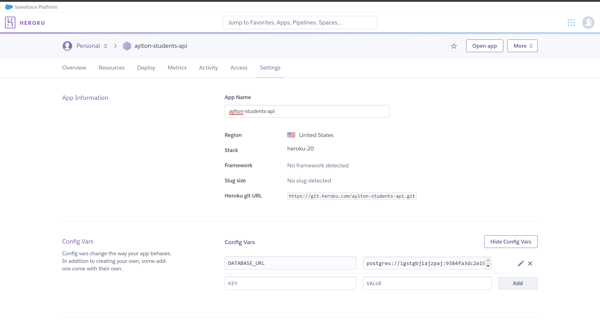

Como podemos ver nossa variável `DATABASE_URL` já foi colocada automaticamente ao adicionarmos o _plugin_ de banco de dados na aula passada. Porém ainda precisamos adicionar tanto a variável `NODE_ENV` quanto `PORT`. A variável `PORT` é automaticamente atualizada pelo **heroku**m então não precisamos nos preocupar com ela. Já o `NODE_ENV` devemos adicionar às configurações, para isso basta preencher o formulário da seguinte forma e clicar em **Add**.

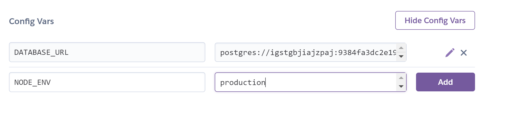

Tendo adicionado nossa variável `NAME`, vamos agora baixar a **CLI** (Interface de Linha de Comando) do **heroku**. Com ela poderemos fazer o _deploy_ de nosso container com apenas alguns comandos. Para instalá-la basta seguir as instruções deste [link](https://devcenter.heroku.com/articles/heroku-cli#download-and-install). Após finalizar a instalação execute o comando `heroku --version` e verifique que ele mostra a versão instalada da **CLI**.

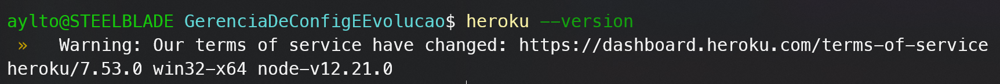

Agora execute o comando `heroku login` para se autenticar por meio do browser.

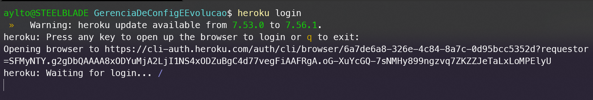

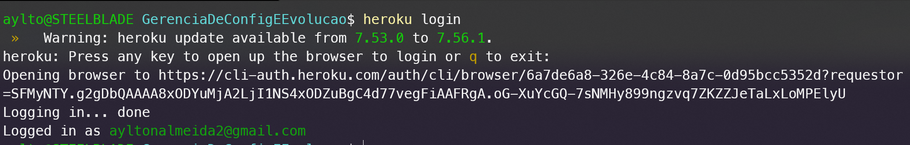

Terminada a configuração inicial, vamos agora executar os comandos de _deploy_. É importante ressalta que você precisa ter executado o comando `docker build` para sua **Students API** e que o container deve estar rodando corretamente para que o processo funcione. Em seguida execute os seguintes comandos de dentro do terminal no **VSCode** com sua **Students API**.

O comando `heroku container:login` apenas no autentica com o _registry_ (sistema de armazenamento de containers) do **heroku**. Já o comando `heroku container:push web --app [PROJECT_NAME]` faz o _push_ da nossa imagem _docker_ para esse _registry_. Ao rodar esse comando lembre-se de substituir o o nome do app pelo nome do seu projeto no **heroku**.

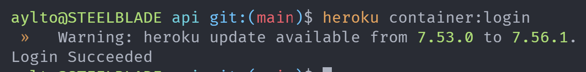
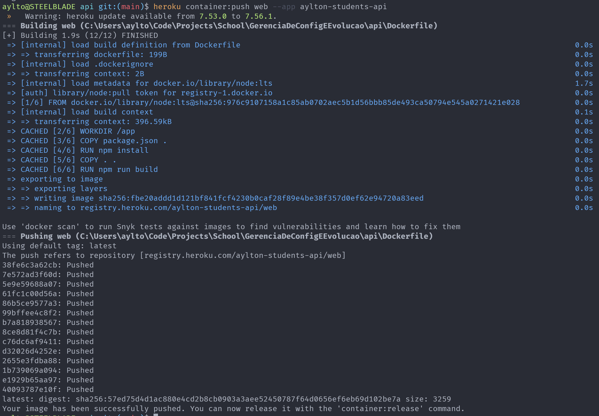

Por fim basta executarmos o comando `heroku container:release web --app [PROJECT_NAME]`, lembrando de usar o nome do seu projeto, para fazermos o _deploy_ dessa nova versão.

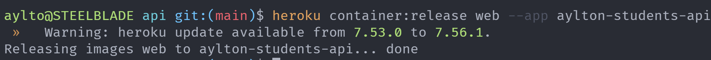

Para conferirmos que tudo está certo, basta ir ao seu projeto no **heroku**, clicar em _open app_ e adicionar alguma rota da api como `/ping` na url. Caso tudo esteja certo, você deveria ver uma resposta vinda direto de sua **Students API**.

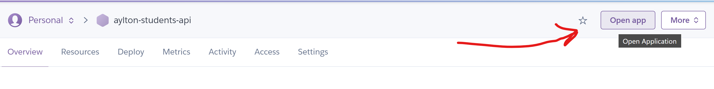
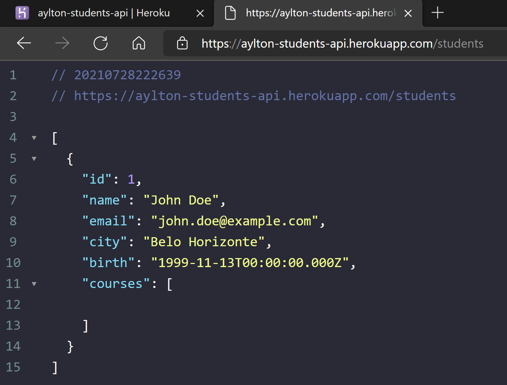

## Atividade proposta 2

Como segunda atividade, atualize também sua pipeline no **Github Actions** a fim de hospedar sua aplicação no **heroku** junto do banco de dados criado na ultima aula. Para isso crie um novo _job_ que será responsável por ler as variáveis de ambiente para fazer login no **heroku** e executar os comandos aprendidos durante esse roteiro. Lembre-se também de atualizar as variáveis de ambiente do **heroku** com as usadas em nossa **Students API**.
