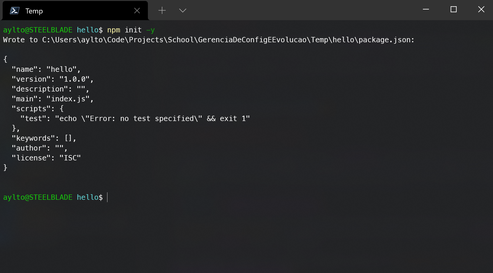
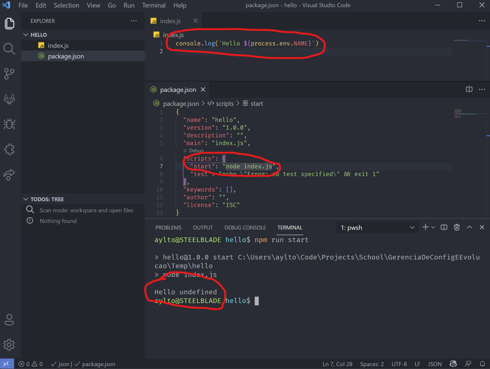

# Aula 7 - Roteiro

Nesta aula iremos aprender a declarar _containers_ usando arquivos `Dockerfile`. Também aprenderemos como fazer a _build_ deles e executa-los, a fim de permitir uma distribuição mais fácil e maior escalabilidade para nossa aplicação.

Para essa aula, preparei um vídeo mostrando como configurar um ambiente **Docker** no **Windows** por meio da utilização do **WSL**:

<!-- TODO: Colocar link aqui -->

- [Configuração do Docker com WSL]()

## Criando um container Docker

O primeiro passo para criação de um _container_ está na criação de um arquivo `Dockerfile`. Nesse arquivo precisaremos declarar os comandos necessários para configuração e execução de nosso container. Para este roteiro, vamos criar um novo projeto em **NodeJS** que nos diga uma saudação com base em um nome armazenado em uma variável de ambiente. Para isso, basta criarmos uma nova pasta e executarmos o comando `npm init -y` e abrir o projeto no **VSCode**.



No **VSCode**, vamos criar um arquivo `index.js`, que nada mais faz do que ler uma variável de ambiente `NAME` e diz 'hello' para ela (Em **Javascript** a leitura de variáveis de ambiente é feita por meio do objeto `process.env`). Para testar nosso app, vamos adicionar um comando `start` ao `package.json` que executa nosso arquivo `index.js` e testar nosso app.



Por enquanto iremos ver apenas um 'Hello undefined', já que não declaramos nenhuma variável de ambiente. Porém iremos resolver isso na declaração de nosso container. Comece criando um arquivo `Dockerfile` e siga os passos abaixo para aprender os comandos básicos.

```Dockerfile

# O comando FROM diz ao container qual imagem base usar, nesse
# caso usaremos a imagem do NodeJS versão estável (LTS)
FROM node:lts

# O comando WORKDIR declara em qual pasta estaremos trabalho no
# container. Aqui estamos trabalhando dentro de uma pasta
# chamada app
WORKDIR app

# O comando copy faz exatamente o que ele sugere, copia os
# arquivos da máquina local para o container, aqui estamos
# copiando ambos index.js e package.json para a pasta atual
# dentro do container.
COPY index.js package.json .

# O comando ENV é usado para declarar variáveis de ambiente
# Aqui estamos declarando uma variável NAME com valor 'John'
ENV NAME 'John'

# O comando CMD é usado para declarar o que o container fará
# quando for executado. Em nosso caso ele executará o comando
# npm start
CMD 'npm start'

```

## Atividade Proposta

Para colocarmos em prática o que vimos hoje, vamos criar uma pipeline simples para o nosso projeto. Nela devemos fazer o **checkout** dentro dele, rodar todos os testes e executar um _build_, listando ao fim o conteúdo da pasta `dist` com os arquivos prontos para implantação do app. Para isso precisamos fazer os seguintes passos:

- Use o comando `npm install` para instalar as dependências do projeto.
- Use o comando `npm run test` para rodar os testes.
- Use o comando `npm run build` para fazer o _build_ do projeto.
- Use o comando `ls dist` para listar o conteúdo da pasta `dist`.

Lembre-se que em uma _pipeline_ segura, caso os testes falhem o _build_ não será executado.
