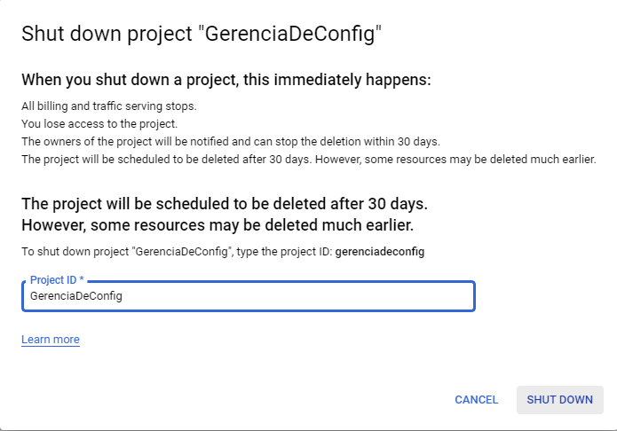

# Aula 8 - Roteiro

Nesta aula iremos aprender a criar uma máquina virtual dentro da **Google Cloud Platform** e nos conectarmos a ela por meio de SSH. Para execução desse roteiro usaremos a **Free Tier** disponível no serviço, que nos permite criar uma VM gratuíta desde que esteja localizada na região **us-central-1**.

Por mais que o serviço usado seja gratuito, será necessário cadastrar um cartão de crédito na plataforma, por conta disso, para evitar futuros gastos, mostrarei também como limpar o projeto a fim de impedir gastos futuros.

## Criando uma VM na Cloud Engine

O primeiro passo é acessar o console da **Google Cloud**. Para isso, acesse o [link](https://cloud.google.com/), faça login e selecione o console.

Caso seja sua primeira vez acessando a **Google Cloud** ela sugerirá que você crie um projeto, caso não seja você será apresentado com o dashboard inicial. Como vamos criar um novo projeto, acesse este [link](https://console.cloud.google.com/projectcreate) para ser redirecionado à página de criação de projetos. Para criar um projeto, basta darmos um nome à ele e selecionar o botão _create_.

Após selecionar a opção de criar um novo projeto, será exibida uma notificação mostrando o progresso da criação dele. Quando ela finalizar, basta clicar em _select project_ que você será redireciona ao dashboard desse projeto.

As máquinas virtuais estão localizadas dentro do serviço de **Compute Engine**. Dessa forma, selecione o menu sanduíche no canto superior esquerdo da página, passe o mouse por cima de **Compute Engine** e selecione **VM instances**.

Você será redirecionado para uma página onde você poderá habilitar a **Compute Engine API**, o que nos permite criar VMs e outros serviços relacionados ao **Compute Engine**. Ao selecionar _enable_ uma mensagem dizendo que _billing_ é necessário aparecerá, siga os passos nas foto para criar uma conta de _billing_.

Após criar uma nova conta, preencha os campos com os dados pedidos e selecione o botão _submit and enable billing_. Como mencionado acima, não usaremos nenhum recurso pago, e ao final do roteiro basta apagar esta conta de _billing_ para evitar qualquer custo. Mas por agora vamos voltar à seção de VMs, para isso use o menu sanduíche, clique em **Cloud Engine > Vm Instances** e selecione _enable_ para habilitar a **Compute Engine API**. Ao solicitar _billing_, selecione _enable_ e selecione a _billing account_ criada.

Clique em _set account_ e aguarde alguns momentos enquanto a API é habilitada. Na página inicial vamos selecionar _create instance_

Ná página de criação da instância dê um nome para ela e preencha o formulário conforme imagens abaixo. As partes mais importantes são selecionar uma instância **f1-micro** e verificar que no canto direito, aonde está o custo mensal estimado, deveria mostrar uma mensagem semelhante à `Your first 744 hours of f1-micro instance usage are free this month`, demonstrando que a instância está livre para uso gratuíto por algumas horas no mês.

Na seção _Boot disk_ vou trocar meu sistema operacional para **Ubuntu** e por fim basta clicar em _create_ para criar a instância.

A criação da instância pode levar algum tempo. Após terminar, selecionar o nome da instância e clique em **ssh** para se conectar à sua nova VM.

Uma nova janela com um terminal abrirá, esse sendo o terminal de sua nova máquina virtual.

E pronto, temos uma VM rodando. Dentro dela podemos fazer basicamente qualquer coisa que queiramos, como por exemplo instalar um projeto que demanda grande de tempo de processamento.

Agora vamos ver como deletar a instância e nosso projeto, assim como nossa conta de _billing_. Para apagar a instância basta clicar na lixeira no canto superior direito da página da VM e confirmar a deleção. Isso pode demorar alguns minutos.

Para deletar o projeto, vamos nos 3 pontinhos ao lado da foto do usuário e selecionar _project settings_.

Na página do projeto, basta clicar em _shut down_, digitar o nome do projeto e confirmar a deleção. Isso também pode demorar alguns minutos.

Por ultimo, para deletar a conta de _billing_, basta abrir o menu sanduíche e selecionar _billing_. Na página clique no nome sua conta de _billing_, ir em _account management_ e clicar em _close billing account_

